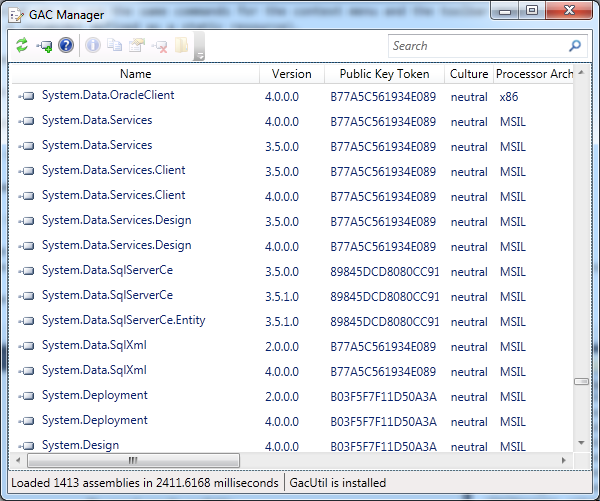

# GAC Manager

GAC Manager is an open source project that comes in two parts - a fully functional application to manage the Global Assembly Cache on your computer, and a C# API to allow you to manage the GAC yourself.
The GAC Manager Application

The GAC Manager Application is designed to offer fast access to the GAC. A lean application lets you search for assemblies quickly and get important information you need.

## The GAC Manager API

The C# API provides all of the functionality required by the GAC Manager Application and is offered to allow developers to write their own applications that work with the GAC.

A description of how to work with the API is available in the following article:

http://www.codeproject.com/Articles/430568/A-GAC-Manager-Utility-and-API
